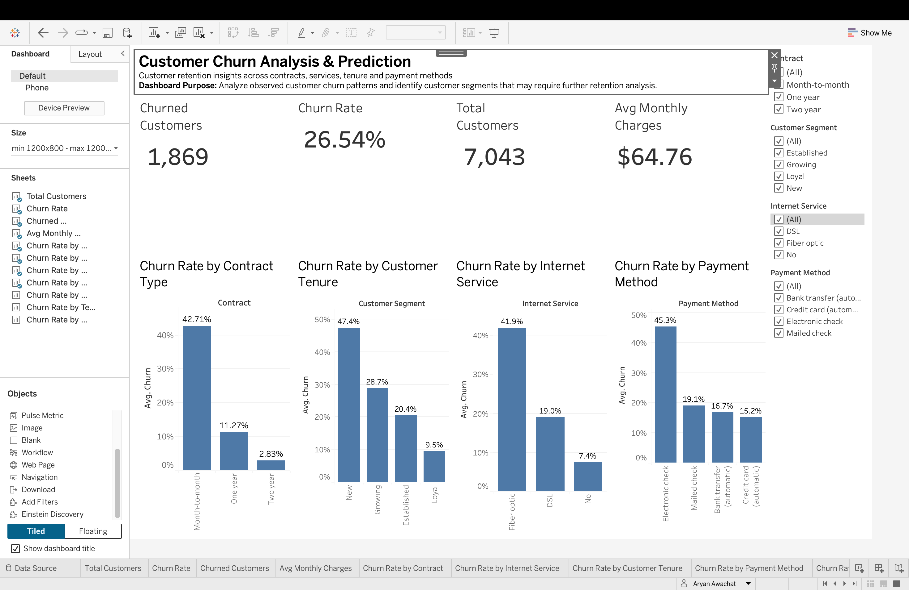

# Customer Churn Analysis & Prediction

## 📌 Project Overview

Customer churn is an important business problem for subscription-based companies. This project analyzes customer data to identify patterns associated with customer churn and develops machine learning models to predict potential churn.

The project combines **Python, SQL, Machine Learning, and Tableau** to perform data cleaning, exploratory data analysis, predictive modeling, and interactive visualization.

---

## 🎯 Objectives

- Analyze customer churn patterns.
- Identify customer characteristics associated with churn.
- Perform data cleaning and exploratory data analysis.
- Use SQL to analyze customer segments and churn rates.
- Build machine learning models for churn prediction.
- Compare Logistic Regression and Random Forest models.
- Create an interactive Tableau dashboard for business analysis.

---

## 📊 Dataset

The project uses a telecommunications customer dataset containing **7,043 customer records and 21 attributes**.

### Key Attributes

- Customer demographics
- Tenure
- Contract type
- Internet service
- Payment method
- Monthly charges
- Total charges
- Technical support
- Online security
- Churn status

The target variable is **Churn**.

---

## 🛠️ Technologies Used

- **Python**
- **Pandas**
- **NumPy**
- **Matplotlib**
- **Seaborn**
- **Scikit-learn**
- **DuckDB / SQL**
- **Tableau**

---

## 🔄 Project Workflow

```text
Raw Dataset
     ↓
Data Cleaning
     ↓
Exploratory Data Analysis
     ↓
Feature Preparation
     ↓
SQL Analysis
     ↓
Machine Learning
     ↓
Model Evaluation
     ↓
Tableau Dashboard
````

---

## 🧹 Data Cleaning

The dataset was examined for data quality issues before analysis.

The `TotalCharges' column was originally stored as an object data type. It was converted into a numeric format using Pandas.

Missing values generated during the conversion were handled appropriately.

Additional derived features were created for analysis, including:

* Customer Tenure Groups
* Monthly Charge Groups
* Customer Segments

---

## 📈 Exploratory Data Analysis

The analysis examined churn patterns across multiple customer attributes, including:

* Churn distribution
* Contract type
* Customer tenure
* Monthly charges
* Internet service
* Payment method
* Technical support
* Online security

These analyses were used to understand relationships between customer characteristics and observed churn.

---

## 🤖 Machine Learning

Two classification models were developed and compared.

### Logistic Regression

| Metric    |  Score |
| --------- | -----: |
| Accuracy  | 80.55% |
| Precision | 65.72% |
| Recall    | 55.88% |
| F1 Score  | 60.40% |

### Random Forest

| Metric    |  Score |
| --------- | -----: |
| Accuracy  | 78.28% |
| Precision | 61.89% |
| Recall    | 47.33% |
| F1 Score  | 53.64% |

The models were evaluated using accuracy, precision, recall, and F1 score.

---

## 🗄️ SQL Analysis

DuckDB was used to perform SQL-based customer churn analysis.

The SQL analysis covers:

* Overall customer and churn summary
* Churn by contract type
* Churn by internet service
* Churn by payment method
* Churn by customer tenure
* Churn by monthly charge range
* Churn by technical support
* Churn by online security

SQL queries are available in:

```text
sql/customer_churn_queries.sql
```

---

## 📊 Tableau Dashboard

An interactive Tableau dashboard was created to provide a visual overview of customer churn.

### Dashboard Preview



### Dashboard KPIs

| KPI                     |  Value |
| ----------------------- | -----: |
| Total Customers         |  7,043 |
| Churned Customers       |  1,869 |
| Churn Rate              | 26.54% |
| Average Monthly Charges | $64.76 |

### Dashboard Visualizations

* Churn Rate by Contract Type
* Churn Rate by Customer Tenure
* Churn Rate by Internet Service
* Churn Rate by Payment Method

### Interactive Filters

Users can filter the dashboard by:

* Contract
* Customer Segment
* Internet Service
* Payment Method

The dashboard is designed to help analyze observed churn patterns across different customer segments.

---

## 📁 Project Structure

```text
customer-churn-analysis-prediction/
│
├── Customer_Churn_Analysis.ipynb
├── customer_churn_tableau.csv
├── requirements.txt
│
└── sql/
    └── customer_churn_queries.sql
```

---

## ▶️ How to Run

### 1. Clone the Repository

```bash
git clone https://github.com/aryanawachat/customer-churn-analysis-prediction.git
```

### 2. Navigate to the Project

```bash
cd customer-churn-analysis-prediction
```

### 3. Install Dependencies

```bash
pip install -r requirements.txt
```

### 4. Open the Notebook

Open:

```text
Customer_Churn_Analysis.ipynb
```

using **Jupyter Notebook, JupyterLab, or Google Colab**.

---

## 🔮 Future Improvements

Possible future improvements include:

* Hyperparameter tuning
* Feature engineering
* Cross-validation
* Additional classification models
* Model explainability using SHAP
* Churn probability scoring
* Deployment using Streamlit
* Automated model monitoring

---

## 👨‍💻 Author

**Aryan S. Awachat**

B.Tech — Electronics & Telecommunication Engineering

Vishwakarma Institute of Technology, Pune

---

## 📌 Project Focus

**Data Analytics | Machine Learning | SQL | Tableau | Customer Churn Prediction**
